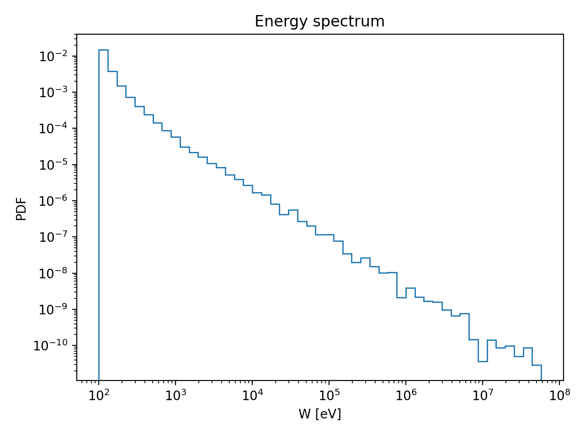
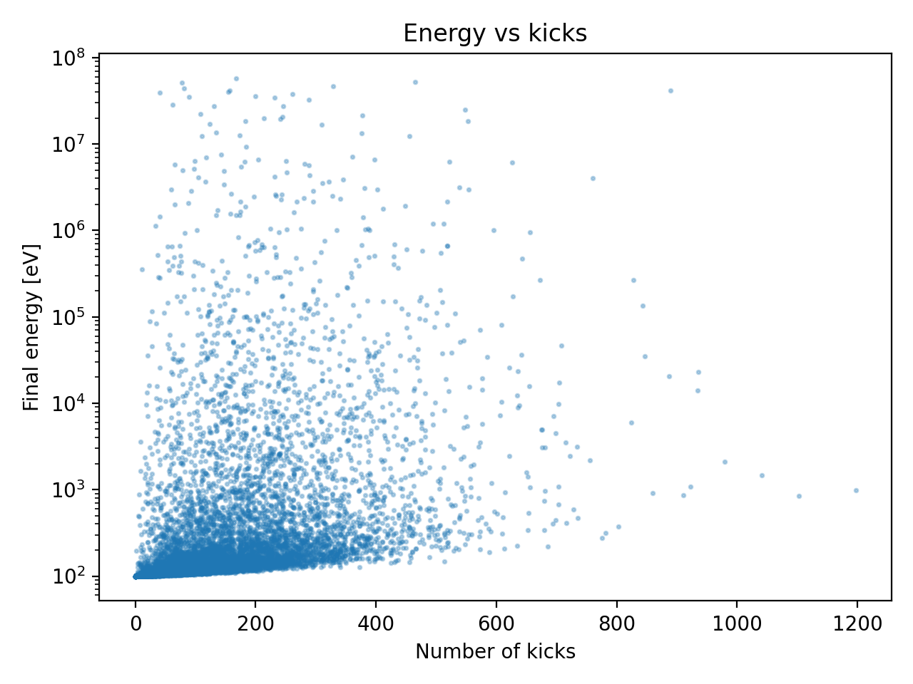
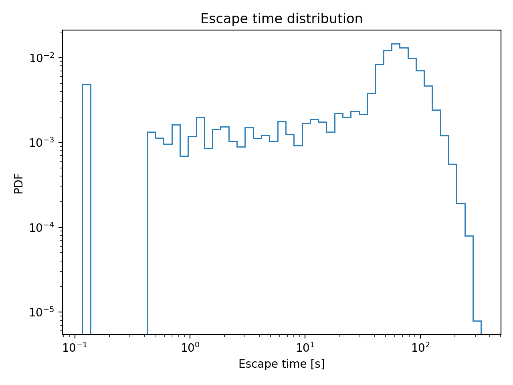

# Charged Particle Acceleration – C++ Simulation

This project is a **simple C++ simulation** that models how particles randomly move inside a box, occasionally gain energy, and eventually escape.
it is a **Monte-Carlo, event-based simulation** designed to study statistical behavior.

## What does this program do?

In very simple terms:

* Many particles start with low energy
* They move randomly inside a 3D box
* Sometimes they receive an **energy “kick”**
* Eventually, they escape the box
* We record:

  * their final energy
  * how many kicks they received
  * how long they stayed inside

The program outputs all results into a single CSV file, which can then be plotted.


## How to build and run

### 1. Compile

```bash
make
```

This produces an executable called `sim`.

### 2. Run

```bash
./sim
```

After running, a file called `results.csv` will be generated.


## Output file

`results.csv` contains one row per particle, with the following columns:

| Column       | Meaning                                |
| ------------ | -------------------------------------- |
| `ip`         | particle ID                            |
| `escaped`    | whether the particle escaped (1 = yes) |
| `t_final`    | time spent inside the box              |
| `W_final_eV` | final energy                           |
| `kkicks`     | number of energy kicks                 |
| `sum_dW_eV`  | total energy gained                    |


## Visualizing the results

We typically plot three simple figures from `results.csv`.

### 1. Energy distribution

This shows how many particles end up at low vs high energy.



---

### 2. Energy vs number of kicks

This shows that **more kicks do not always mean higher energy** — large jumps matter more than many small ones.



---

### 3. Escape time distribution

This shows how long particles stay inside the box before escaping.




## Notes
* The simulation is **statistical**, not deterministic. Results change slightly each run (randomness is intentional)

## Minimal requirements

* C++17 compatible compiler (`g++` or `clang++`)
* `make`
* Python (only for plotting)


